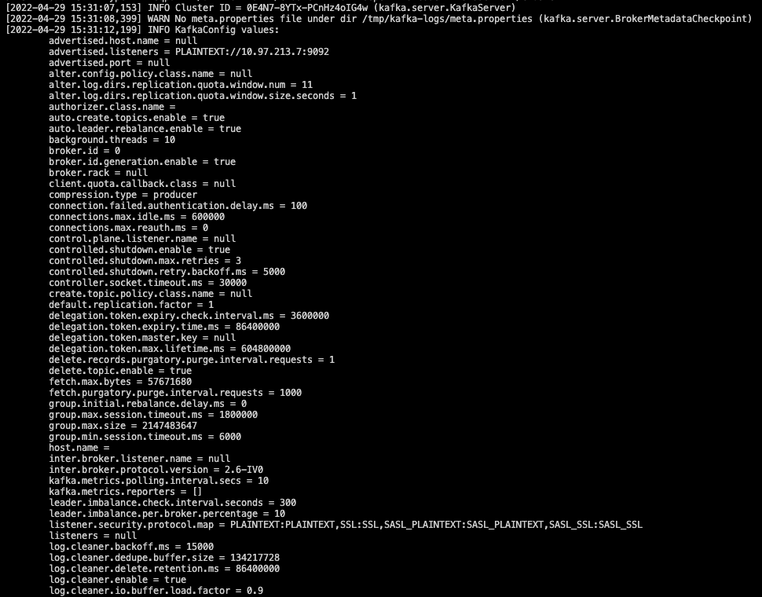
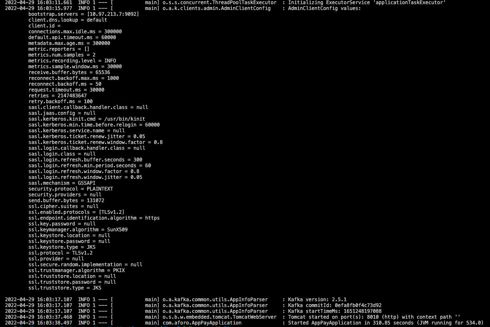

# Kubernetes

# Configuration changes 

Firstly, I had to change the [bootstrap.properties](./app-pay/src/main/resources/bootstrap.properties) file of each microservice in order to make them point to the IP and port of the config server given by Kubernetes.

Change from 
```
spring.cloud.config.uri=http://app-config:8888
```
to
```
spring.cloud.config.uri=http://${CONFIG_CLUSTERIP_SERVICE_SERVICE_HOST}:${CONFIG_CLUSTERIP_SERVICE_SERVICE_PORT}
```

Secondly, I had to fix MySQL database authentication. I changed the DB password in [app pay properties](./config/app-pay-dev.properties) to match MYSQL DB password expected in [docker image built from here](./resources/mysql/Dockerfile/) 

Then, for each microservice, I had to change .properties of [config files ](./config/) to point to env variables containing IP adresses determined by Kubernetes.
## Push built images to dockerhub

Build docker files for each microservices with special tags

```bash
cd ds-exams/midterm2

cd app-config 
docker build -t sebasgarciamo/app-config:mt-2 .
docker push sebasgarciamo/app-config:mt-2 
cd ..

cd app-pay 
docker build -t sebasgarciamo/app-pay:mt-2 .
docker push sebasgarciamo/app-pay:mt-2 
cd ..

cd app-invoice
docker build -t sebasgarciamo/app-invoice:mt-2 .
docker push sebasgarciamo/app-invoice:mt-2 
cd ..

cd app-transaction
docker build -t sebasgarciamo/app-transaction:mt-2 .
docker push sebasgarciamo/app-transaction:mt-2 
cd ..

# Create docker images for databases
cd resources

cd mysql
docker build -t sebasgarciamo/mysql-app-pay:mt-2 .
docker push sebasgarciamo/mysql-app-pay:mt-2 
cd ..

cd postgres
docker build -t sebasgarciamo/postgres-app-invoice:mt-2 .
docker push sebasgarciamo/postgres-app-invoice:mt-2 
cd ..

cd ..
```

## Create Kubernetes pods 

```bash
kubectl create -f kubernetes/deployments/config.yaml
```
Once you execute this, you should see expect this in config pod logs:


```bash
kubectl create -f kubernetes/deployments/kafka.yaml
```
Once you execute this, you should see expect this in Kafka pod logs. It is mounting the advertised host to the environment variable that points to the IP determined by Kubernetes, this is configured in [kafka deployment yaml](./kubernetes/deployments/kafka.yaml):



### Pay

#### MySQL DB

```bash
kubectl create -f kubernetes/deployments/mysql_pay.yaml
```

Once you execute this, you should see expect this in MySQL pay DB pod logs. It is creating the database in which the pay miroservice will save payment operations and then listens for connections.


#### Pay microservice

```bash
# Once the mysql database is running and waiting for connection, run pay. 
# This is done in order to avoid timeout errors. Otherwise, the pay microservice
# may restarts until the database is ready for connections.
kubectl create -f kubernetes/deployments/pay.yaml
```
When the above microservices are on, the pay microservice starts by fetching config from the config microservice. Notice that it is fetching the dev profile from the IP that we are referecing from $CONFIG_CLUSTERIP_SERVICE_SERVICE_HOST environment variable.


Then, it will start the connection to the database microservice available at the IP specified in the BD_PAY_CLUSTERIP_SERVICE_SERVICE_HOST environment variable at port 3306. Once it has connected, it will execute some operations in the DB such as ```drop table pay if exists```


After pay has established connection to the DB, it will connect to the Kafka microservice:



### Invoice

#### Postgres DB

```bash
kubectl create -f kubernetes/deployments/postgres_invoice.yaml
```
#### Invoice microservice


```bash
kubectl create -f kubernetes/deployments/invoice.yaml
```


```bash
kubectl get pods --watch
```

### Step 1: Start config

[](./evidences/steps/step_1_config_starting.png)

# Microservicios con Spring Boot


## Información de los microservicios
El microservicio de invoices, debe listar las facturas de clientes y además debe consumir una cola para cambiar el estado de la factura cuando esta se paga a través del microservicio de pago.
El microservicio de pago debe registrar el pago en su respectiva bd y además debe dejar un mensaje en una cola para actualizar la factura en el microservicio de facturas y además debe dejar un mensaje en una cola para registrar el movimiento en el microservicio de transacciones.
El microservicio de transacciones debe listar las transacciones de una factura, además debe consumir una cola para obtener las transacciones de pago del microservicio de pago.
Todos los microservicios deben consumir la cadena de conexión desde el servicio de configuración centralizada.

La información de los endpoints disponibles por microservicio se incluyen en el documento de INFO.md
## Scripts de creación de bases de datos

La informacion de como crear las bases de datos y sus respectivas tablas se incluyen en google.com

## Tecnologías utilizadas

- Spring Boot (Java Framework JDK v11+)
- Gradle (Gestor de dependencias)
- Postman (Test de endpoints/servicios rest)
- Postgresql (Base de Datos)
- MySQL (Base de Datos)
- MongoDB (Base de Datos NoSQL)
- Kafka (Gestor de Mensajería)
- Github (Repositorio para proyecto y Configuraciones de micorservicios)
